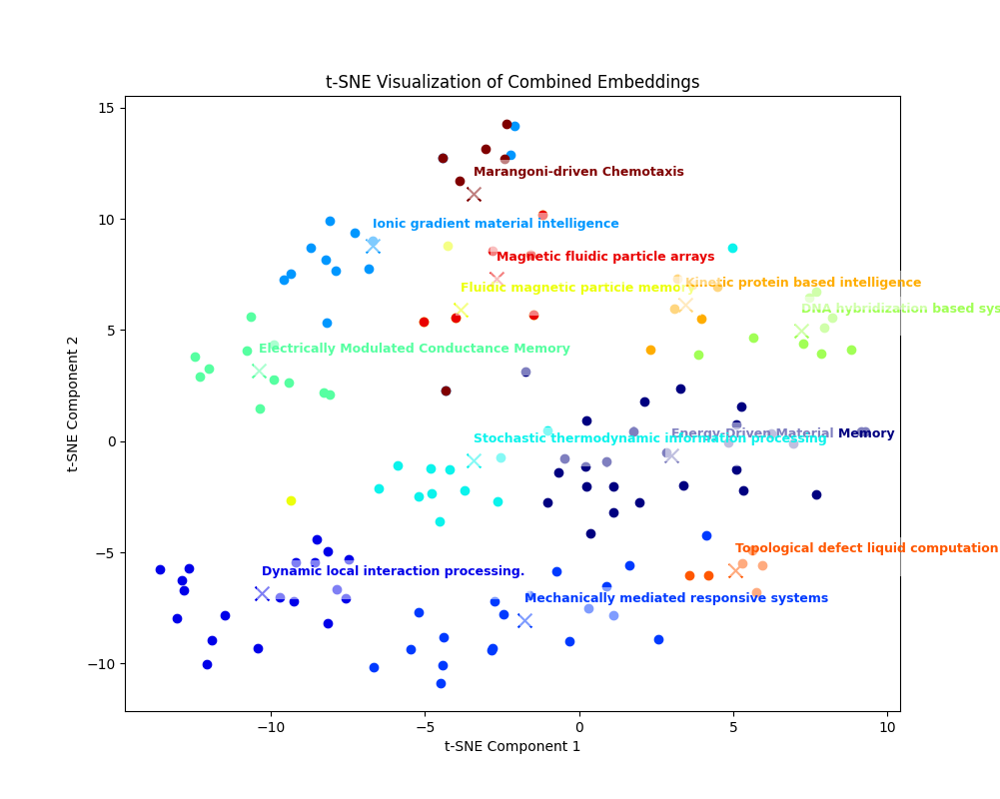
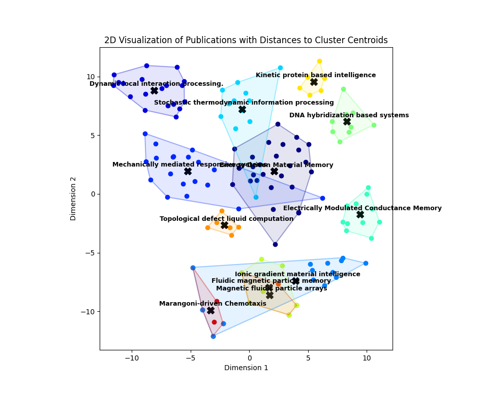
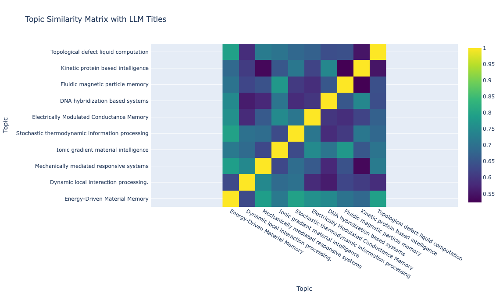
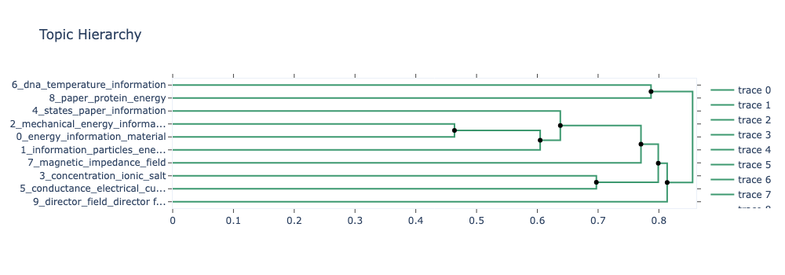

# IntelliDE: Intelligence Discovery Engine

**Towards a Formal Definition of Cognition in Non-Biological Systems**

## Overview

The **Intelligence Discovery Engine (IntelliDE)** is a computational framework designed to facilitate the exploration and definition of intelligence in non-biological systems, with a particular focus on material intelligence. This project leverages advanced natural language processing (NLP) techniques, including Large Language Models (LLMs) and topic modeling, to analyze scientific literature and extract key insights related to the emerging field of intelligent materials.

The engine aims to:

1. **Identify and characterize** different types or categories of material intelligence from a corpus of scientific publications.
2. **Uncover the underlying principles and mechanisms** that enable intelligence in non-biological matter.
3. **Discover hierarchical relationships and overlaps** between different approaches to achieving material intelligence.
4. **Define criteria** for evaluating the "intelligence" or cognitive capabilities of these systems.
5. **Generate insights** that can guide the design and development of novel intelligent materials.
6. **Automate** the process of scientific discovery.

## Core Features

*   **Automated Text Processing Pipeline:** The engine processes a collection of research papers, extracts relevant information, and prepares it for analysis.
*   **LLM-Powered Analysis:** Employs Large Language Models (LLMs) through OpenRouter API to perform in-depth analysis of individual publications based on a structured framework, mimicking the critical evaluation of a Nature/Science referee.
*   **Topic Modeling with BERTopic:** Uses BERTopic, a state-of-the-art topic modeling technique, to cluster publications based on semantic similarity and identify key topics or categories of material intelligence [https://maartengr.github.io/BERTopic/].
*   **Hierarchical Topic Analysis:** Explores hierarchical relationships between topics, revealing a structured understanding of the field.
*   **Cluster Analysis and Evaluation:** Analyzes the characteristics of each cluster, generates descriptive titles and summaries using LLMs, and evaluates individual publications against cluster-specific criteria.
*   **Interactive Visualizations:** Generates various visualizations to help explore the data and interpret the results, including:
    *   Topic frequency plots (with and without outliers)
    *   Intertopic distance maps
    *   Topic hierarchy visualizations
    *   t-SNE plots of publications in 2D, colored by cluster, with interactive hover information
    *   Radar charts representing the average evaluation scores for each cluster
    *   Plot publications in 2D space with their distances to cluster centroids.
*   **Markdown and JSON Output:** Saves analysis results in both human-readable Markdown format and structured JSON format for further processing.

## Results

The Intelligence Discovery Engine (IdeliDE) analyzes scientific literature on material intelligence to produce a range of visualizations that illuminate the structure and relationships within this emerging field. 

A key output is an interactive t-SNE plot that maps publications as points in a 2D space, colored by their assigned cluster, allowing users to explore the semantic similarity between documents and identify clusters of related research; hovering over a point reveals the publication's key, and circles are drawn around clusters to highlight potential overlaps. 



The 2D visualization of publications generated by the Intelligence Discovery Engine is a scatter plot that represents each publication as a point in a two-dimensional space, primarily using t-SNE (t-distributed Stochastic Neighbor Embedding) for dimensionality reduction, with an option to use UMAP as well. This plot is designed to visually demonstrate the relationships and clustering of research papers based on their semantic similarity as determined by their high-dimensional embeddings.



The program also generates a topic similarity matrix heatmap that uses LLM-generated titles to label axes, offering an intuitive visualization of how similar or dissimilar the identified topics are to each other. 



It also generates topic hierarchy plot, enhanced with LLM titles, presents a tree-like structure of the topics, revealing the hierarchical relationships between them.



A topic frequency plot displays the prevalence of each identified topic using a bar chart, with a clear distinction between the frequency of topics in the entire dataset and in the dataset excluding outliers (topic -1), providing insights into the core themes and the presence of noise.  Lastly, radar charts are used to evaluate publications against predefined criteria relevant to material intelligence (such as the presence of specific sections or keywords extracted from the documents), with each cluster represented in a separate subplot showing the average scores across multiple evaluation criteria, effectively summarizing each cluster's alignment with aspects of intelligent behavior in soft matter. 


## Project Structure

```
Intelligence-Discovery-Engine/
├── main.py                 # Main program script
├── analysis.py             # Functions for analysis and visualization
├── utils.py                # Utility functions
├── OpenRouter_Methods.py   # Functions for interacting with the
├── requirements.txt        # Requirements file
├── .env                    # environment file with API keys
├── AI/                  # Example directory for Zotero data (BibTeX and PDFs)
│   ├── AI.bib           # BibTeX file
│   └── files/*.pdf        # PDF files of publications
├── Catechism/
│   ├── Perspective.md      # Example of a context file for LLM
│   └── Paper_Template.md   # Template for analysis of publications
├── prompts/
│   ├── perform_clustering_prompt.txt # Prompt for full analysis
│   └── perform_clustering_title_prompt.txt  # Prompt for titles generation
├── synthetic/
│   └── publications/       # Generated reports in .md format
└── cluster_analysis_results/ # Cluster analysis results
└── topic_tree.md            # Resulting topic hierarchy in Markdown format
```


The Intelligence Discovery Engine consists of the following core components:

### 1. `main.py`

This is the main entry point for the program. It orchestrates the entire analysis pipeline, including:

*   Loading data from a Zotero library (PDFs and BibTeX metadata).
*   Extracting text from PDFs using `pdfplumber`.
*   Generating research prompts using a predefined template and the `generate_paper_prompt` function.
*   Analyzing each publication using an LLM API (OpenRouter) via the `APIHandler` class.
*   Saving individual publication reports in Markdown and JSON formats using `save_presenter`.
*   Performing BERTopic analysis on the collected reports.
*   Generating visualizations of clusters, topic hierarchies, and evaluation results.
*   Saving the topic tree to a file.
*   Evaluating publications against cluster-specific criteria using radar charts.

### 2. `analysis.py`

This module contains functions for performing BERTopic analysis, generating visualizations, and evaluating publications. Key functions include:

*   **`analyze_clusters`:** Analyzes clusters using LLM, generating descriptions and titles, and saves results.
*   **`perform_bertopic_analysis`:** Performs topic modeling using BERTopic.
*   **`visualize_topic_hierarchy`:** Creates a hierarchical topic visualization using Plotly.
*   **`visualize_topic_similarity`:** Generates a topic similarity heatmap.
*   **`visualize_embeddings_with_tsne`:** Creates a t-SNE plot of publication embeddings.
*   **`plot_topic_distances`:** Generates a 2D plot of publications and cluster centroids.
*   **`plot_section_topic_distribution`:** Plots the distribution of topics within sections.
*   **`plot_topic_word_scores`:** Plots word scores for a specific topic.
*   **`visualize_representative_docs`:** Displays representative documents for each topic.
*   **`save_topic_tree`:** Saves the topic tree data to a file using pickle.
*   **`load_topic_tree`:** Loads the topic tree data from a file.
*   **`save_topic_tree_to_markdown`:** Saves the topic tree to a Markdown file.

### 3. `utils.py`

This module provides utility functions for data loading, preprocessing, and plotting:

*   **`load_data_from_json`:** Loads data from JSON files.
*   **`load_template`:** Loads the template structure from a Markdown file.
*   **`extract_answers`:** Extracts answers from publications based on the template.
*   **`get_embedding`:** Generates embeddings for text using a Sentence Transformer model.
*   **`combine_embeddings`:** Combines multiple embeddings into a single vector.
*   **`plot_within_cluster_distances`:** Plots the distribution of distances within a cluster.
*   **`plot_topic_frequencies_stacked`:** Plots topic frequencies with and without outliers using stacked bars.
*   **`read_markdown_file`:** Reads the content of a markdown file.

### 4. `OpenRouter_Methods.py`

This module contain API-specific functions for interacting with the OpenRouter. It handles:

*   Setting up logging.
*   Initializing API clients.
*   Sending requests to the API and getting responses.
*   Saving results in Markdown and JSON formats.

### 5. `Catechism` Directory

This directory contains template files that define the structure of the analysis and guide the LLM in its evaluation:

*   **`Perspective.md`:** Provides background information and context for the LLM, including the definition of "cognizant matter" and the criteria for evaluating intelligence in materials.
*   **`paper.md`:** Contains the structured framework (questions) that the LLM uses to analyze each publication.

### 6. `prompts` Directory

*   **`perform_clustering_prompt.txt`:** The prompt template used to generate descriptions for each cluster using an LLM.
*   **`perform_clustering_title_prompt.txt`:** A shorter prompt template used to generate concise titles for each cluster using an LLM, based on the cluster descriptions.

### 6. `AI` Directory

The output of Zotero collection with **`AI.bib`** file containing metadata of publications to analyse and corresponding PDF files in `\files` folder.

## Dependencies

*   **bertopic:** For topic modeling (`pip install bertopic`).
*   **sentence-transformers:** For generating sentence embeddings (`pip install sentence-transformers`).
*   **umap-learn:** For dimensionality reduction (`pip install umap-learn`).
*   **scikit-learn:** For t-SNE and other utilities (`pip install scikit-learn`).
*   **matplotlib:** For plotting (`pip install matplotlib`).
*   **plotly:** For interactive visualizations (`pip install plotly`).
*   **networkx:** For graph manipulation (`pip install networkx`)
*   **pandas:** For data manipulation (`pip install pandas`).
*   **pdfplumber:** For PDF text extraction (`pip install pdfplumber`).
*   **bibtexparser:** For parsing BibTeX files (`pip install bibtexparser`).
*   **python-dotenv:** For managing environment variables (`pip install python-dotenv`).
*   **scipy:** For spatial algorithms (convex hull) (`pip install scipy`).
*   **tqdm:** For progress bars (`pip install tqdm`)
*   **openai:** For interaction with OpenRouter API (`pip install openai`)

You can install all dependencies using:

```bash
pip install bertopic sentence-transformers umap-learn scikit-learn matplotlib plotly networkx pandas pdfplumber bibtexparser python-dotenv scipy tqdm openai
```

## Setup and Usage

### Prerequisites

- Python 3.8+
- Zotero
- OpenRouter API access
- Required Python packages (install via pip):
  ```bash
  pip install -r requirements.txt
  ```

### Setting up API Keys

1. Obtain API keys for OpenRouter from [OpenRouter.ai](https://openrouter.ai/)
2. Create a `.env` file in the root directory of the project
3. Add your API keys to the `.env` file:

```bash
OPENROUTER_API_KEY=your_openrouter_api_key
```

### Data Preparation

#### Zotero Collection Setup
- Organize your research papers in a [Zotero](https://www.zotero.org/) collection
- Export the collection as a BibTeX file (e.g., `AI.bib`) and place it in a directory (e.g., `AI`)
- Ensure that the corresponding PDF files are in the same directory. The `pdf_path` in the code assumes a relative path like `./AI/files/your_paper.pdf`

#### Template Files

1. **Context Template** (`Catechism/Perspective.md`):

```markdown

The text provided as a context for better LLM generation.

...
```

2. **Paper Analysis Template** (`Catechism/Paper_Template.md`):
```markdown
# Paper Analysis Framework

## Key Questions
1. [Question 1]
2. [Question 2]
...
```

3. **Clustering Prompts**:
- `prompts/perform_clustering_prompt.txt`: Template for general clustering analysis
- `prompts/perform_clustering_title_prompt.txt`: Template for title generations for BerTopic clusters.


### Configuration Parameters

#### BERTopic Parameters
- `min_topic_size`: Minimum size of topics (default: 5)
- `n_neighbors`: Number of neighbors for UMAP (default: 15)
- `min_dist`: Minimum distance for UMAP (default: 0.1)

#### Visualization Parameters
- UMAP parameters for dimensionality reduction
- t-SNE parameters for visualization

## Running the Program

Execute the program using:

```bash
python main.py
```

The program will:
1. Generate individual publication reports in Markdown and JSON format in the `synthetic/publications` directory
2. Perform BERTopic analysis and generate visualizations
3. Save results in the `cluster_analysis_results` directory
4. Create `topic_tree.md` with the topic hierarchy

## Example Usage

If you have:
- A Zotero collection exported as `AI-3.bib`
- Corresponding PDFs in an `AI-3` directory
- Customized template files in the `Catechism` directory
- Plan to use the OpenRouter API for LLM analysis

Then follow these steps:

1. Ensure your environment is set up correctly:
```bash
pip install -r requirements.txt
cp .env.example .env
# Edit .env with your API keys
```

2. Prepare your data:
```bash
mkdir AI
```
From Zotero client `Save` the collection to the disk with ticking PDFs.


3. Run the analysis:
```bash
python main.py --api openrouter
```

4. Check the results in:
- `synthetic/publications/` for individual reports
- `cluster_analysis_results/` for clustering analysis
- `topic_tree.md` for the topic hierarchy

## Output Structure

### Individual Publication Reports
```markdown
# Publication Analysis: [Title]

## Metadata
- Authors: [Authors]
- Year: [Year]
- DOI: [DOI]

## Analysis
[Analysis content based on template]

## Topic Classification
[Topic classification results]
```

### Topic Hierarchy
```markdown
# Topic Hierarchy

## Topic 1: [Topic Name]
- Subtopic 1.1
  - Paper 1
  - Paper 2
- Subtopic 1.2
  ...

## Topic 2: [Topic Name]
...
```

## Troubleshooting

Common issues and their solutions:

1. API Connection Issues:
   - Check your API keys in `.env`
   - Verify network connection
   - Ensure API service is available

2. PDF Processing Issues:
   - Verify PDF file permissions
   - Check file paths
   - Ensure PDFs are text-searchable

3. Memory Issues:
   - Reduce batch size
   - Process fewer papers at once
   - Increase available RAM

## Contributing

1. Fork the repository
2. Create your feature branch
3. Commit your changes
4. Push to the branch
5. Create a new Pull Request

## License

[Your chosen license]

## Acknowledgments

- BERTopic team
- OpenRouter team
- Zotero team

