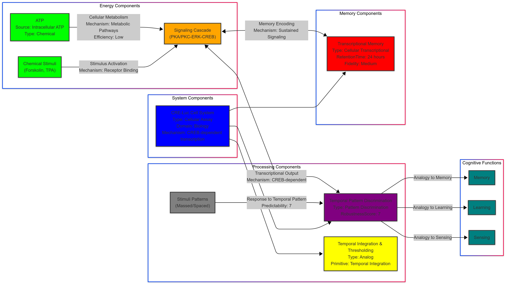

# The massed-spaced learning effect in non-neural human cells:

__Paper Type:__ Experimental

## M1: System Overview & Implementation
*   **Vector ID:** M1
*   **Vector Type:** Overview

### **1.1 System Description**

*   **Vector ID:** M1.1
*   **Vector Type:** Description
    *   Content: The system is a non-neural, immortalized human cell line (SH-SY5Y) stably expressing a short-lived luciferase reporter gene under the control of a CREB-dependent promoter (CRE-luc cell line).  The system is designed to emulate training protocols used in memory studies, utilizing forskolin (PKA activator) and TPA (PKC activator) as stimuli to mimic neuromodulators like serotonin. The purpose is to investigate the massed-spaced learning effect, a hallmark of memory formation, in a simplified cellular system outside of neural circuits. The system measures luciferase expression as a proxy for memory after different patterns of forskolin and TPA stimulation (single "massed" pulse vs. multiple "spaced" pulses).
    *   CT-GIN Mapping: `SystemNode` attributes: `systemType`: "Cellular Assay", `domain`: "Biology", `mechanism`: "CREB-dependent transcription", `components`: "Human neuroblastoma cell line, Luciferase reporter, Forskolin, TPA", `purpose`: "Study massed-spaced learning effect in non-neural cells"
    *   Implicit/Explicit: Explicit
        *  Justification: The system description is directly stated in the abstract and introduction of the paper, outlining the cell line, reporter system, stimuli, and research objective.

### **1.2 Implementation Clarity**

*   **Vector ID:** M1.2
*   **Vector Type:** Score
    *   Score: [9]
    *   Justification: The implementation is very clearly described, detailing the cell line, reporter construct, drug treatments, and measurement techniques (luciferase assay, Western blot, immunofluorescence). Figures and supplementary figures further clarify the experimental design and signaling pathways.  Minor details on cell culture conditions might be found in standard methods, but the core implementation is well-explained.
    *   Implicit/Explicit: Explicit
        * Justification: The clarity stems from the detailed descriptions of materials, methods, and experimental protocols in the Results and Methods sections of the paper.

### **1.3 Key Parameters**

*   **Vector ID:** M1.3
*   **Vector Type:** ParameterTable
    *   Table:
        | Parameter Name | Value | Units | Source (Fig/Table/Section) | Implicit/Explicit | Data Reliability (High/Medium/Low) | Derivation Method (if Implicit) |
        | :------------- | :---: | :---: | :-----------------------: | :-----------------: | :-----------------------------: | :-------------------------------: |
        | Forskolin Concentration | 2 | µM | Results Section, Fig 2B,G | Explicit | High | N/A |
        | TPA Concentration | 2 | nM | Results Section, Fig 2C,F | Explicit | High | N/A |
        | Pulse Duration | 3 | min | Results Section, Fig 2B,C,E-G | Explicit | High | N/A |
        | Inter-Trial Interval (ITI) | 10, 20, 30 | min | Results Section, Fig 3A-C | Explicit | High | N/A |
        | Luciferase Measurement Time | 4, 24 | hour | Results Section, Fig 2B,C,E-G, 3A-C | Explicit | High | N/A |

    *   **Note:** N/A

## M2: Energy Flow
*   **Vector ID:** M2
*   **Vector Type:** Energy

### **2.1 Energy Input**

*   **Vector ID:** M2.1
*   **Vector Type:** Input
    *   Content: The primary energy source is chemical energy in the form of ATP within the cells, utilized for cellular processes including gene transcription and protein synthesis, which are activated downstream of the agonists forskolin and TPA stimulation. The stimuli themselves (forskolin and TPA) are exogenous chemical inputs acting as triggers or modulators, not primary energy sources.
    *   Value: N/A
    *   Units: N/A
    *   CT-GIN Mapping: `EnergyInputNode`: attributes - `source`: "Intracellular ATP", `type`: "Chemical"
    *   Implicit/Explicit: Implicit
        *  Justification:  While ATP is not explicitly mentioned as the energy source *for the experiment design*, it is implicitly understood as the fundamental energy currency driving cellular processes like transcription and translation, which are being measured via luciferase expression. The paper focuses on stimuli and signaling pathways but presumes basal cellular energy metabolism.

### **2.2 Energy Transduction**

*   **Vector ID:** M2.2
*   **Vector Type:** Transduction
    *   Content: The energy transduction begins with the binding of forskolin and TPA to cellular receptors (implicitly present in SH-SY5Y cells, though not specified). Forskolin activates adenylyl cyclase, increasing cAMP levels, which in turn activates Protein Kinase A (PKA). TPA directly activates Protein Kinase C (PKC). Both PKA and PKC then phosphorylate downstream targets, including Extracellular signal-Regulated Kinase (ERK) and cAMP Response Element-Binding protein (CREB). Phosphorylated CREB (P-CREB) acts as a transcription factor, binding to the CRE promoter region of the luciferase reporter gene, leading to increased transcription of luciferase mRNA and subsequent luciferase protein synthesis. Chemical energy stored in ATP is utilized during transcription and translation. Light energy is emitted as bioluminescence during the luciferase assay, serving as the readout signal.
    *   CT-GIN Mapping: `EnergyTransductionEdge`: attributes - `mechanism`: "Chemical Signaling Cascade", `from_node`: "Chemical Stimuli (Forskolin, TPA)", `to_node`: "Luciferase Expression";  Intermediate nodes could be added for receptors, PKA/PKC, ERK, CREB.
    *   Implicit/Explicit: Mixed
        *  Justification: The signaling pathway (PKA, PKC, ERK, CREB) and their roles in CRE-dependent transcription are explicitly described. The initial receptor binding and ATP utilization are implicit common knowledge in cellular biology, underpinning the described mechanisms.

### **2.3 Energy Efficiency**

*   **Vector ID:** M2.3
*   **Vector Type:** Score
    *   Score: [4]
    *   Justification/Metrics: The energy efficiency of the system is likely low. A significant portion of the chemical energy from ATP consumed in cellular processes will be dissipated as heat due to metabolic inefficiencies inherent in biological systems and signaling cascades.  The luciferase reporter system is designed for signal amplification (detectability) rather than energy efficiency.  No metrics are provided for quantifying energy efficiency in the paper, making a precise score impossible. Qualitative assessment: Low to Medium compared to engineered systems, but typical for biological cellular processes.
    *   CT-GIN Mapping: Attribute of `EnergyTransductionEdge`s: `efficiency`: "Low (Qualitative)"
    *   Implicit/Explicit: Implicit
      *  Justification: Efficiency is not directly discussed, but it's implicitly low due to the nature of biological signaling pathways and metabolism. The focus is on signal transduction and amplification, not energy conservation.

### **2.4 Energy Dissipation**

*   **Vector ID:** M2.4
*   **Vector Type:** Dissipation
    *   Content: Energy dissipation mechanisms include heat generated from cellular metabolism (basal and agonist-induced metabolic activity), inefficiencies in signal transduction pathways (e.g., spontaneous dephosphorylation, off-target effects), and during luciferase protein synthesis and degradation.  The luciferase assay itself dissipates energy as light and heat. Quantitatively, dissipation cannot be estimated from the paper. Qualitatively, energy dissipation is likely Medium to High, typical for cellular signaling processes.
    *   CT-GIN Mapping: Creates `EnergyDissipationNode`s: `type`: "Heat, Metabolic Waste, Inefficient Signaling", and `EnergyDissipationEdge`s: `from_node`: "Cellular Processes", `to_node`: "Environment"
    *    Implicit/Explicit: Implicit
        *  Justification:  Energy dissipation is not quantified but is implicitly understood as a natural consequence of cellular metabolism and signaling. Biological systems are known to be thermodynamically open and dissipative.

## M3: Memory
*   **Vector ID:** M3
*   **Vector Type:** Memory

### **3.1 Memory Presence:**

*   **Vector ID:** M3.1
*   **Vector Type:** Binary
    *   Content: [Yes]
    *   Justification: Yes, the system exhibits memory. The "massed-spaced effect" demonstrates that the response to stimulation (luciferase expression at 24h) is dependent on the temporal pattern of prior stimuli, not just the total amount of stimulation. Spaced pulses lead to a stronger and more sustained luciferase expression compared to a massed pulse, indicating a persistent change induced by the spaced training, affecting future response (luciferase expression at a later time point). This persistent change in cellular state based on past stimuli pattern is a form of memory.
    *    Implicit/Explicit: Explicit
        * Justification: The paper explicitly frames the observed massed-spaced effect in luciferase expression as analogous to memory formation in neural systems. The sustained difference in luciferase expression at 24h due to different training protocols is direct evidence of memory.

### **3.2 Memory Type:**

*   **Vector ID:** M3.2
*   **Vector Type:** Score
*   Score: [6]
*   Justification:  Score of 6. The memory is analogous to short-term to intermediate-term memory in biological systems. Retention is observed up to 24 hours, with clear differences between spaced and massed training at this time point. Capacity is limited; it's a single readout (luciferase expression level) reflecting the integrated transcriptional response to the training pattern. Read-out accuracy is evidenced by statistically significant differences in luciferase expression between training protocols.  It's not multi-state memory like in digital systems, and likely degrades over longer time periods beyond 24h (implicit assumption based on "forgetting curves" analogy). It's not as robust or versatile as high-fidelity engineered memory, hence a mid-range score.
*   CT-GIN Mapping: Defines the `MemoryNode` type: `memoryType`: "Cellular Transcriptional Memory", `fidelity`: "Medium"
*    Implicit/Explicit: Mixed
    * Justification: The paper explicitly demonstrates retention up to 24h and differences based on training protocols. The score and memory type classification are based on interpretation and comparison to biological memory characteristics, drawing implicit analogies.

### **3.3 Memory Retention Time:**

*   **Vector ID:** M3.3
*   **Vector Type:** Parameter
*   Value: [~24]
*    Units: [hour] (observable effect at 24 hours)
*   Justification: The massed-spaced effect, used as a proxy for memory, is clearly observed at the 24-hour time point after training. The difference in luciferase expression between spaced and massed training is most pronounced at 24h (Fig. 2E-G, Fig. 3A-C). While the effects are measured at 2, 4, and 24 hours, the most significant "memory" readout is at 24h, indicating a retention time of at least this duration for the cellular "memory" of the spaced training pattern.
*    Implicit/Explicit: Explicit
        * Justification: The 24-hour time point is explicitly used to measure the long-term effects and is where the differences related to "memory" are most evident in the presented data (figures and text).
*   CT-GIN Mapping: Key attribute of the `MemoryNode`: `retentionTime`: "24 hours"

### **3.4 Memory Capacity (Optional - if applicable)**

* **Vector ID:** M3.4
* **Vector Type:** Parameter
*  Value: [Limited to the CRE-Luc reporter output, Effectively binary (Spaced vs Massed)]
*   Units: [Qualitative description]
*   Justification: The memory capacity is limited in this system. It primarily differentiates between "spaced" and "massed" training protocols in terms of luciferase expression levels at 24 hours.  While the luciferase signal is quantitative, it essentially serves as a binary readout in this context - distinguishing whether spaced training (stronger signal) or massed training (weaker signal) was applied.  The system doesn't demonstrate storage or retrieval of complex patterns or multiple distinct memories. It's more like a single bit of cellular memory reflecting the temporal pattern of stimulation.
*    Implicit/Explicit: Implicit
        *  Justification: The limited capacity is inferred from the experimental design and the focus on differentiating only two training paradigms (massed vs spaced) using a single, scalar output (luciferase expression).

### **3.5 Readout Accuracy (Optional - if applicable)**

* **Vector ID:** M3.5
* **Vector Type:** Parameter
*   Value: [Statistically significant differences, p < 0.05 to p < 0.0001]
*   Units: [p-value]
*   Justification: Readout accuracy is supported by statistically significant p-values reported in figure legends for differences in luciferase expression between spaced and massed training conditions at 24h (e.g., Fig 2E-G, Fig 3A-C). These p-values (ranging from <0.05 to <0.0001) indicate a statistically reliable difference in luciferase expression based on the training protocol, suggesting reasonably accurate readout of the cellular "memory".
*    Implicit/Explicit: Explicit
       *  Justification: The p-values are explicitly stated in the figure legends and represent a standard measure of statistical significance, implying a degree of readout accuracy.
*   CT-GIN Mapping: e.g., Attribute of `MemoryNode` or related `ReadoutEdge`: `readoutAccuracy`: "Statistically Significant"

### **3.6 Degradation Rate (Optional - if applicable)**
* **Vector ID:** M3.6
* **Vector Type:** Parameter
    *   Value: [Observed decay in luciferase expression after single pulse by 24h, sustained expression after 4 pulses.]
    *   Units: [Qualitative Description]
    *   Justification: Figure 2E, F, and G show that luciferase expression induced by a single pulse decreases significantly from 4h to 24h. In contrast, luciferase expression after four pulses remains relatively stable from 4h to 24h and is significantly higher at 24h compared to the single pulse. This demonstrates a difference in decay rates: faster decay after massed (single pulse) stimulation and slower decay/sustained expression after spaced (four pulses) stimulation, indicative of differential degradation rates or sustained transcriptional activity.
    *    Implicit/Explicit: Explicit
            * Justification: The differential decay is directly observed in the luciferase expression time-course data presented in Figure 2E, F, and G and described in the Results section.
    *   CT-GIN Mapping: e.g., Attribute of the `MemoryNode`: `degradationRate`: "Differential, faster decay after massed, slower after spaced stimulation"

### **3.7 Memory Operations Energy Cost (Optional - if applicable)**
* **Vector ID:** M3.7
* **Vector Type:** Table
*   Table:
    | Memory Operation ID | Energy Consumption per Bit | Power Usage during Operation| Units | Uncertainty | Data Source Reference | Implicit/Explicit | Justification |
    | :------------------ | :--------------------------: | :-----------------------------: | :---: |:-----------------:|:-----------------:|:-----------------:| :------------------ |
    | Memory Encoding (Spaced Training) | N/A | N/A | N/A | N/A | N/A | Implicit | Energy cost of cellular signaling, transcription, and translation related to CRE-Luc activation. Not quantified in paper. |
    | Memory Readout (Luciferase Assay) | N/A | N/A | N/A | N/A | N/A | Implicit | Energy cost of luciferase enzymatic reaction and photon emission detection. Not quantified in paper. |
*   Implicit/Explicit: Implicit
    *   Justification: The paper does not quantify energy consumption for memory operations. Energy costs are implicitly associated with cellular signaling and metabolic processes, but no specific measurements are provided.

### **3.8 Memory Fidelity & Robustness Metrics (Optional - if applicable)**
* **Vector ID:** M3.8
* **Vector Type:** Table
*   Table:
    | Metric ID | Description | Value | Units | CT-GIN Mapping | Data Source | Implicit/Explicit | Justification |
    | :-------- | :---------- | :----: | :---: | :-------------: | :----------: |:-----------------:| :-----------------:|
    | Statistical Significance (p-value) |  Reliability of difference between spaced vs massed training effects  | p < 0.05 to p < 0.0001 | N/A | `MemoryNode` fidelity | Fig. 2, 3 Legends | Explicit | P-values indicate statistical confidence in observed memory effect. |
    | Reproducibility | Number of independent experiments showing the effect | N = 3 to 14 | Experiments | `MemoryNode` robustness | Fig. 2, 3 Legends | Explicit | Experiments were repeated multiple times (N values) suggesting reproducibility. |
*   Implicit/Explicit: Mixed
*   Justification: Statistical significance and reproducibility are explicitly indicated by p-values and N values in figure legends, supporting memory fidelity and robustness. However, "fidelity" and "robustness" are interpretations in the context of memory-like behavior, making it mixed explicit and implicit.
---

## M4: Self-Organization and Emergent Order
*   **Vector ID:** M4
*   **Vector Type:** Self-Organization

### **4.1 Self-Organization Presence:**

*   **Vector ID:** M4.1
*   **Vector Type:** Binary
    *   Content: [No]
    *   Justification: No, self-organization in the sense of spontaneous emergence of global order from local interactions is not explicitly demonstrated or claimed in this paper for the CRE-luc cell system. The system is engineered with a specific reporter construct and is externally stimulated by forskolin and TPA. The observed "massed-spaced effect" is a result of a defined experimental protocol and intracellular signaling pathways, not spontaneous self-assembly or pattern formation without external instruction. While cellular processes are inherently self-organizing at many levels, the paper focuses on a stimulus-driven, reporter-based assay and does not investigate emergent spatial patterns or complex self-regulation beyond the signaling cascade.
    *   Implicit/Explicit: Explicit
        *  Justification: The experimental design is based on externally controlled stimulation and measurement. The paper describes stimulus-response behavior within cells, not emergence of order from local rules independent of external drivers in the context of material self-organization.

**(Conditional: If M4.1 is "No", skip to Module 5. If "Yes", include M4.2-M4.7)**
N/A

## M5: Computation
*   **Vector ID:** M5
*   **Vector Type:** Computation

### **5.1 Embodied Computation Presence:**

*   **Vector ID:** M5.1
*   **Vector Type:** Binary
    *   Content: [Yes]
    *   Justification: Yes, the system exhibits a form of embodied computation. The cell's internal signaling network (PKA, PKC, ERK, CREB pathway) acts as a computational substrate that processes the temporal pattern of chemical stimuli (forskolin and TPA). The "computation" is in how the cell integrates the spaced or massed pulses of stimuli and translates this temporal pattern into a differential transcriptional output (luciferase expression). The biochemical network within the cell, not an external controller, performs this signal processing based on its inherent properties and reaction kinetics. This is a rudimentary form of analog computation embodied within the cellular system.
    *    Implicit/Explicit: Mixed
        *  Justification: The paper does not explicitly use the term "embodied computation," but implicitly describes the cellular signaling network as "decoding" temporal patterns of stimulation (Results section). The interpretation of this decoding as a form of embodied computation is an inference based on the framework of material intelligence.

### **5.2 Computation Type:**

*   **Vector ID:** M5.2
*   **Vector Type:** Classification
    *   Content: [Analog]
    *   CT-GIN Mapping: `ComputationNode` type: `computationType`: "Analog"
    *    Implicit/Explicit: Mixed
    *    Justification: The computation is analog because the cellular signaling pathways operate through continuous variations in concentrations of signaling molecules, phosphorylation levels, and reaction rates, rather than discrete digital states. The luciferase expression output is also a continuous, analog signal.  Though not explicitly labeled as "analog computation," the underlying mechanisms are inherently analog in nature as biochemical networks.

### **5.3 Computational Primitive:**

*   **Vector ID:** M5.3
*   **Vector Type:** Function
    *   Content: Temporal Integration and Thresholding. The cell integrates the pulsatile stimuli over time. Spaced pulses lead to a summated effect that surpasses a threshold for stronger and sustained luciferase expression. A single massed pulse, while eliciting immediate response, results in a weaker and less sustained downstream effect, effectively acting as a sub-threshold stimulus for long-term output. The CREB-dependent transcription acts as a thresholding mechanism – requiring sufficient integrated upstream signaling to drive significant gene expression.
    *   **Sub-Type (if applicable):** Temporal Integration, Thresholding: CREB activation
    *   CT-GIN Mapping: Defines the primary function of the `ComputationNode`: `computationalPrimitive`: "Temporal Integration and Thresholding"
    *   Implicit/Explicit: Mixed
    * Justification: The paper explicitly describes the difference in response to spaced vs. massed pulses, indicating temporal integration. The concept of a threshold is implicit in the idea that a certain level of CREB activation is needed for significant transcriptional output, and that spaced stimulation crosses this more effectively for long-term effects.

### **5.4 Embodied Computational Units**
* **Vector ID:** M5.4
* **Vector Type:** Table
*   Table:
| Unit ID | Description | Processing Power | Energy/Operation | Freq/Resp. Time | Bit-Depth | Data Source | Implicit/Explicit | Justification |
| :------ | :---------- | :--------------- | :--------------- | :--------------: | :-------: | :----------: |:-----------------:| :-----------------:|
| Cellular Signaling Network | PKA/PKC-ERK-CREB pathway | Rudimentary temporal integration | Low (estimated) | Seconds to hours | Analog (continuous conc.) | Fig 1, S1 | Implicit |  Processing power and energy/operation are qualitative estimations. Response time is based on experimental timescales. Bit-depth is analog due to continuous signal nature. |

## M6: Temporal Dynamics
*   **Vector ID:** M6
*   **Vector Type:** Temporal

### **6.1 Timescales:**

*   **Vector ID:** M6.1
*   **Vector Type:** ParameterTable
    *   Table:
        | Timescale Description | Value | Units | Source | Implicit/Explicit | Justification |
        | :-------------------- | :---: | :---: | :----: | :----------------: | :------------: |
        | Stimulus Pulse Duration | 3, 12 | min | Fig. 2, 3 | Explicit | Experimental parameter |
        | Inter-Trial Interval (ITI) | 10, 20, 30 | min | Fig. 3 | Explicit | Experimental parameter |
        | ERK Phosphorylation (peak) | ~ Immediately after treatment | min | Fig. 3D, E, F-H | Explicit |  Western blot and IF data timing |
        | CREB Phosphorylation (peak) | ~ Immediately after treatment | min | Fig. 3D, E, S4B | Explicit | Western blot data timing |
        | Luciferase Expression (early) | 4 | hour | Fig. 2B, C, E-G | Explicit | Experimental measurement time |
        | Luciferase Expression (late, memory readout) | 24 | hour | Fig. 2E-G, Fig. 3A-C | Explicit | Experimental measurement time, memory effect window |
        | ERK Phosphorylation (residual, sustained at 24h) | > 4 | hour | Fig. S4A, B | Explicit | Western blot time course |

### **6.2 Active Inference:**

*   **Vector ID:** M6.2
*   **Vector Type:** Assessment
    *   Content: [No]
    *   Justification: No, active inference is not demonstrated or evident in this system. The cells are passive recipients of external stimuli (forskolin, TPA) and do not actively adjust their behavior or internal state to minimize prediction error or surprise based on an internal model of the environment. The system lacks (1) prediction of future states, (2) action selection to minimize discrepancies, and (3) internal models. The cells respond based on pre-programmed (biological) signaling pathways triggered by the stimuli, but there is no indication of an internal model driving behavior to reduce surprise. The "massed-spaced effect" is an inherent property of the signaling system in response to temporal patterns, not an active inferential process.
    *   Implicit/Explicit: Implicit
        *  Justification: Active inference is a high-level cognitive function not expected in isolated non-neural cells in culture. The system's behavior is well-explained by basic stimulus-response mechanisms and known signaling pathways, without needing active inference as an explanatory framework.
    *   **If Yes/Partial, provide examples of testable CT-GIN metrics that *could* be used to quantify active inference:** N/A

## M7: Adaptation
*   **Vector ID:** M7
*   **Vector Type:** Adaptation

### **7.1 Adaptive Plasticity Presence:**

*   **Vector ID:** M7.1
*   **Vector Type:** Binary
    *   Content: [Yes]
    *   Justification: Yes, the system exhibits adaptive plasticity, albeit in a basic form. The "massed-spaced effect" itself is a form of adaptive plasticity – the cellular response (luciferase expression) changes persistently (up to 24h) depending on the experience (training protocol: massed vs. spaced pulses). This is not simple stimulus-response; the system's future response is modified by the prior pattern of stimulation. The molecular mechanism (ERK and CREB activation, potentially changes in CREB protein levels) provides a basis for this persistent change based on experience (training).  This is a form of learning, which is a type of adaptive plasticity.
    *    Implicit/Explicit: Mixed
        * Justification: The paper explicitly demonstrates the "massed-spaced effect" and its molecular correlates, framing it as analogous to learning and memory. The interpretation of this effect as a form of adaptive plasticity is an inference aligning with the concept of learning-induced changes.

**(Conditional: If M7.1 is "No", skip to Module 8. If "Yes", include M7.2)**

### **7.2 Adaptation Mechanism:**

*   **Vector ID:** M7.2
*   **Vector Type:** Description
    *   Content: The adaptation mechanism is linked to the differential activation of ERK and CREB signaling pathways by spaced vs. massed stimulation. Spaced pulses lead to stronger and more sustained ERK and CREB phosphorylation and potentially an increase in total CREB protein levels (at 24h). This enhanced and prolonged signaling in response to spaced training is proposed to be the molecular basis for the stronger and more sustained luciferase expression, i.e., the "memory" effect. Inhibition of ERK or CREB blocks the massed-spaced effect, further supporting their role in this adaptive plasticity. The mechanism is not explicitly defined by equations or algorithms in the paper, but it is described in terms of a signal transduction cascade where temporal pattern of input modulates the magnitude and duration of downstream signaling and transcriptional output. It is not Hebbian learning, reinforcement Learning or evolutionary algorithm, but more akin to a form of experience-dependent synaptic plasticity in neurons, here happening at the cellular level.
    *   CT-GIN Mapping: Defines the `AdaptationNode` type: `adaptationMechanism`: "ERK-CREB signaling dependent plasticity"; `Monad` edges: relate stimuli patterns to changes in signaling and gene expression. Type of adaptation mechanism: "Signal Transduction Plasticity"
    *    Implicit/Explicit: Mixed
        *  Justification:  The involvement of ERK and CREB and the blocking effect of inhibitors are explicitly shown experimentally. The precise mechanism of how spaced pulses lead to enhanced/sustained signaling is not fully elucidated at a mechanistic equation level, making some aspects implicit. The classification as "Signal Transduction Plasticity" is an interpretive categorization.

## M8: Emergent Behaviors
*   **Vector ID:** M8
*   **Vector Type:** Behavior

### **8.1 Behavior Description:**

*   **Vector ID:** M8.1
*   **Vector Type:** Description
    *   Content: The main functional behavior is "temporal pattern discrimination in transcriptional response". The system distinguishes between different temporal patterns of chemical stimulation (massed vs. spaced pulses) and exhibits a differential transcriptional output (CRE-luciferase expression) as a consequence. Spaced pulses lead to a stronger and more sustained transcriptional response compared to massed pulses. This behavior is observed in non-neural human cells and is analogous to the massed-spaced learning effect seen in behavioral and synaptic plasticity in neural systems.
    *   CT-GIN Mapping: `BehaviorArchetypeNode`: `behaviorType`: "Temporal Pattern Discrimination", `subtype`: "Transcriptional Response Modulation"
    *    Implicit/Explicit: Explicit
       *  Justification: The behavior is directly observed and quantified as luciferase expression levels in response to different stimulation protocols, and explicitly described as "massed-spaced effect".

### **8.2 Behavior Robustness:**

*   **Vector ID:** M8.2
*   **Vector Type:** Score
    *   Score: [7]
    *   Justification: Score of 7. Robustness is demonstrated by the reproducibility of the massed-spaced effect across multiple independent experiments (N values in figures range from 3 to 14). The effect is shown for different agonists (TPA, forskolin, TPA+forskolin) and in two different cell lines (SH-SY5Y and HEK293), indicating some generality.  However, robustness to other types of perturbations is not systematically tested (e.g., temperature variations, noise in agonist delivery, genetic variations within cell line). The system's robustness is likely limited to the specific experimental conditions tested in the paper.  Qualitative Assessment: Medium-High robustness within the studied experimental scope.
    *   Implicit/Explicit: Mixed
        *  Justification: Reproducibility across experiments and agonists suggests robustness within the experimental context (explicit). The score and qualitative assessment of robustness to untested perturbations are implicit inferences based on typical biological system variability and limitations of the study's scope.
    *   CT-GIN Mapping: e.g., This score contributes to the reliability attributes of the `BehaviorArchetypeNode`: `robustnessScore`: 7

### **8.3 CT-GIN Emergent Behavior Validation**

*    **Vector ID:** M8.3
*    **Vector Type:** Validation
     *  Content: Validation methods include:
        *   Operational definition of "massed-spaced effect" as statistically significant difference in luciferase expression at 24h between spaced and massed training (quantified by luciferase assay).
        *   Control experiments comparing spaced training to massed training and vehicle control (Fig. 3A-C).
        *   Quantitative analysis of luciferase expression (luminescence measurements, Western blots - Fig. 2, 3, 4).
        *   Molecular mechanism validation using inhibitors of ERK and CREB, demonstrating blockade of the massed-spaced effect (Fig. 4).
        *   Reproducibility demonstrated by multiple independent experiments (N values in figures).
        *   Extension to a different cell line (HEK293) to show generality (Fig. 4C, D).
        *   Limitations of validation: the "behavior" is a reporter gene expression level, an indirect proxy for cellular memory, and is studied in a simplified in vitro system, potentially lacking the complexity of in vivo biological memory.
     *   Implicit/Explicit: Explicit
    *   Justification: Validation methods are clearly described throughout the Results and Methods sections, with specific references to Figures and experimental designs used to support the claims of massed-spaced effect.

## M9: Cognitive Proximity
*   **Vector ID:** M9
*   **Vector Type:** Cognition

### **9.1 Cognitive Mapping:**

*   **Vector ID:** M9.1
*   **Vector Type:** Description
    *   Content: Yes, there is a significant attempt to map system functionality to cognitive processes, specifically memory and learning. The paper explicitly draws an analogy between the observed "massed-spaced effect" in non-neural cells and the "massed-spaced learning effect" in animals, which is a hallmark of memory formation. Luciferase expression is used as a "proxy for memory". The molecular mechanisms (ERK and CREB activation) are also mapped to known signaling pathways involved in memory formation in neurons. The paper discusses "cellular cognition" beyond neural systems and explores the potential of non-neural cells to exhibit "canonical features of memory". Limitations: analogy is metaphorical; cellular luciferase expression is a simplified readout compared to complex behavioral memory in animals.
    *   CT-GIN Mapping: Defines a `CognitiveMappingEdge`: from `BehaviorArchetypeNode` ("Temporal Pattern Discrimination") to `CognitiveFunctionNode` ("Memory", "Learning").
    *   Implicit/Explicit: Explicit
    * Justification: The paper explicitly and repeatedly draws parallels between the observed cellular phenomena and cognitive processes like memory and learning, framing the research within the context of "cellular cognition".

### **9.2 Cognitive Proximity Score:**

*   **Vector ID:** M9.2
*   **Vector Type:** Score
    *   Score: [3]
    *   Justification: Score of 3. Level 3: Reactive/Adaptive Autonomy. The system exhibits basic adaptation (plasticity) by modulating its transcriptional response based on the temporal pattern of stimuli (massed vs. spaced). It shows a persistent change (memory) and reacts differently to different inputs based on past "experience" (training protocol). However, it's a very limited behavioral repertoire (single output: luciferase expression), lacks goal-directedness, planning, relational or abstract cognition. It’s a sub-organismal level responsivity (Level 2) progressing towards basic adaptive autonomy (Level 3) due to the temporal pattern discrimination and memory-like persistence. It does surpass simple responsivity (Level 1) because the response is not fixed but modulated by previous input pattern. It’s far from higher levels like goal-directed, model-based, abstract, or social cognition. Overstating cognitive claims should be avoided; it's cellular responsivity with analogies to basic memory features, not complex cognition.
    *   Implicit/Explicit: Mixed
    *  Justification: The score is based on the *CT-GIN Cognizance Scale* criteria, evaluating the system's demonstrated functionalities against the levels. The system clearly surpasses Level 1 (Simple Responsivity) exhibiting adaptive changes based on stimuli patterns, placing it at least at Level 2 or 3.  The specific score of 3 is a judgment balancing demonstrated adaptive behavior with the absence of higher-level cognitive features, making it a mixed explicit (demonstrated behavior) and implicit (interpretation within cognitive scale).

**CT-GIN Cognizance Scale:**

*   **Level 0: Non-Cognitive:** Purely reactive system.  No internal state beyond immediate stimulus-response.
*   **Level 1: Simple Responsivity:** Basic stimulus-response behavior.  Reactions are fixed and predetermined.
*   **Level 2: Sub-Organismal Responsivity:**  Behavior exhibits basic forms of adaptation or plasticity, but lacks complex representation or goal-directedness.
*   **Level 3: Reactive/Adaptive Autonomy:** System adapts its behavior based on experience and feedback, but within a limited behavioral repertoire.
*   **Level 4: Goal-Directed/Model-Based Cognition:** System exhibits goal-directed behavior based on internal models of the world, allowing for planning and flexible action selection.
*   **Level 5: Contextual/Relational Cognition:** System understands and responds to relationships between objects, events, and concepts.
*   **Level 6: Abstract/Symbolic Cognition:** System can manipulate abstract concepts and symbols, enabling logical reasoning and problem-solving.
*   **Level 7: Social Cognition:** System exhibits social intelligence, understanding and interacting with other agents.
*   **Level 8: Metacognition/Self-Awareness:** System possesses awareness of its own internal states and cognitive processes.
*   **Level 9: Phenomenal Consciousness:**  System exhibits subjective experience (qualia). (Currently theoretical for material systems)
*   **Level 10: Sapience/Self-Reflective Consciousness:** System possesses self-awareness, understanding of its own existence, and ability for complex abstract thought. (Currently theoretical for material systems)

### **9.3 Cognitive Function Checklist**

* **Vector ID:** M9.3
* **Vector Type:** Checklist
    *   | Cognitive Function               | Score (0-10) | Justification/Notes                                                                       | CT-GIN Mapping (if applicable) | Implicit/Explicit | Justification for Implicit/Explicit/Mixed |
    | :-------------------------------- | :----------: | :------------------------------------------------------------------------------------ | :--------------------------------: | :-----------------:|:-----------------:|
    | Sensing/Perception               | 2          | Senses chemical stimuli (forskolin, TPA). Basic, limited to these specific inputs.   | `CognitiveFunctionNode`: "Sensing"   | Explicit          | Based on experimental design.  |
    | Memory (Short-Term/Working)        | 4          | Transient ERK/CREB activation, lasts for minutes to hours initially.              | `CognitiveFunctionNode`: "Short-Term Memory" | Mixed             | Duration estimation based on signaling dynamics & Fig. S4A. |
    | Memory (Long-Term)                 | 6          | Sustained luciferase expression at 24h, differential response to spaced training.     | `CognitiveFunctionNode`: "Long-Term Memory" | Explicit          | Evidenced by 24h luciferase assay data/massed-spaced effect. |
    | Learning/Adaptation              | 5          | Massed-spaced effect: response adapts based on temporal pattern of stimulation.       | `CognitiveFunctionNode`: "Learning"   | Explicit          | Direct observation of massed-spaced effect. |
    | Decision-Making/Planning          | 1          | No evidence of decision-making or planning.  Output is a direct response.            | `CognitiveFunctionNode`: "Decision-Making"| Explicit          | System is reactive, not proactive or goal-directed. |
    | Communication/Social Interaction | 0          | No communication or social interaction in this isolated cell system.                | `CognitiveFunctionNode`: "Communication" | Explicit          | System is isolated cell line. |
    | Goal-Directed Behavior            | 1          | No goal-directed behavior. Response is stimulus-driven, not directed towards a goal.  | `CognitiveFunctionNode`: "Goal-Directed Behavior" | Explicit          | System's behavior is reactive. |
    | Model-Based Reasoning              | 0          | No model-based reasoning; system reacts to stimuli, no internal model evident.     | `CognitiveFunctionNode`: "Model-Based Reasoning" | Explicit          | No evidence of internal models or reasoning. |
    | **Overall score**                 |      2.3       |                                                                                       |                                   |                     |                |

    *   **Note:** N/A

## M10: Criticality Assessment
*   **Vector ID:** M10
*   **Vector Type:** Criticality

### **10.1 Criticality:**

*   **Vector ID:** M10.1
*   **Vector Type:** Assessment
    *   Content: [Unclear]
    *   Justification: Unclear. The paper does not explicitly discuss criticality or examine the system for scale-free behavior, power laws, or long-range correlations. While biological systems CAN exhibit criticality, there's no data or analysis in this paper to assess if the CRE-luc cell system operates near a critical point.  Signaling pathways like MAPK (ERK cascade) can exhibit complex dynamics, including bistability, which could be related to criticality, but this is not directly investigated in the context of criticality in this paper.  No explicit evidence for or against criticality is presented.
        *   Critical Parameters (If Yes/Partial): N/A
        *   Evidence: N/A
    *   Implicit/Explicit: Implicit
    *    Justification: Criticality is not addressed in the paper. Assessment is based on the absence of any discussion or relevant data provided in the publication.

## M11: Review Paper Specifics (Conditional)

**(This entire module is conditional and *only* appears if the paper type is "Review")**
N/A

## M12: Theoretical Paper Specifics (Conditional)

**(This entire module is conditional and *only* appears if the paper type is "Theoretical")**
N/A

## M13: Overall Assessment & Scoring

*   **Vector ID:** M13
*   **Vector Type:** Overall

### **13.1 CT-GIN Readiness Score:**

*   **Vector ID:** M13.1
*   **Vector Type:** Score
*   **Calculated Score:** [5.9]

**CT-GIN Readiness Summary Table:**

| CT-GIN Aspect                   | Strength (Yes/Partial/No) | Key Supporting Metrics (with units) | Limitations (Missing Metrics/Data Gaps)                                           | Improvement Areas (Future Research)                                          |
| :------------------------------ | :-----------------------: | :-----------------------------------| :------------------------------------------------------------------------------- | :---------------------------------------------------------------------------- |
| Energy Flow Efficiency          | No                        | Qualitative: Low                     | Quantified energy input, transduction efficiency, dissipation mechanisms        | Measure metabolic rate changes with stimuli, quantify ATP consumption, heat loss |
| Memory Fidelity                 | Partial                   | p < 0.05 to p < 0.0001                | Memory capacity, readout accuracy, degradation rate (quantitative, beyond 24h) | Explore memory retention beyond 24h, test memory capacity for multiple inputs |
| Organizational Complexity       | No                        | Basic signaling pathway             | Self-organization, emergent spatial patterns, hierarchical structure            | Investigate spatiotemporal dynamics of signaling, cellular self-assembly/morphology changes |
| Embodied Computation            | Yes                       | Temporal Integration, Thresholding      | Computational primitives beyond temporal integration, processing power metrics  | Explore more complex computational tasks the cellular system can perform |
| Temporal Integration            | Yes                       | ITI: 10-30 min, Measurement: 24 hours |  Timescales of individual signaling steps, precise network dynamics               |  Measure dynamics of each signaling component with higher temporal resolution  |
| Adaptive Plasticity             | Yes                       | Massed-Spaced Effect                | Mechanism at molecular level, adaptation to diverse stimuli                   |  Detailed molecular mechanism of plasticity, test adaptation to varying stimuli patterns and intensities |
| Functional Universality         | No                        | Limited to transcriptional response  | Demonstrating diverse behaviors beyond reporter gene expression              |  Couple cellular response to functional outputs beyond reporter gene expression (e.g., motility, secretion) |
| Cognitive Proximity            | Partial                   | Cognitive Proximity Score: 3        | Higher-level cognitive functions, goal-directedness, model-based reasoning       |  Design experiments to probe for goal-directedness or planning in cellular responses, even rudimentary. |
| Design Scalability & Robustness | Yes                       | Reproducible across cell lines        | Robustness to diverse perturbations, scalability to complex systems             | Test robustness to wide range of perturbations, explore scalability in multicellular systems |
| **Overall CT-GIN Readiness Score** |        5.9                |   |   |      |

### **13.2 Qualitative CT-GIN Assessment Conclusion:**

*   **Vector ID:** M13.2
*   **Vector Type:** Textual Summary
    *   Content: This paper presents a rigorously designed experimental study demonstrating a memory-like "massed-spaced effect" in non-neural human cells, achieving a CT-GIN Readiness Score of 5.9. Key Strengths include clear implementation of a cellular reporter system, robust demonstration of temporal pattern discrimination in transcriptional response, and validation of the molecular mechanism through ERK/CREB signaling. The system exhibits rudimentary embodied computation and adaptive plasticity. Key Limitations stem from the system's simplicity: low energy efficiency (inferred), limited memory capacity and fidelity (primarily binary distinction), lack of self-organization and higher organizational complexity, limited functional universality (confined to reporter gene expression), and low cognitive proximity (Level 3: basic adaptive autonomy, far from goal-directed or model-based cognition). Overall Assessment: The system represents a valuable experimental model for studying basic forms of cellular memory and temporal information processing in non-neural cells. Its potential within CT-GIN lies in providing a simplified, scalable platform for dissecting fundamental mechanisms of temporal encoding and adaptive cellular responses, but it is a long way from demonstrating complex cognizant matter properties.

### **13.3 CT-GIN Refinement Directions:**

*   **Vector ID:** M13.3
*   **Vector Type:** Recommendations
    *   * Quantify energy consumption for different training protocols and memory operations to assess energy efficiency of cellular “memory”.
    *   Investigate mechanisms for enhancing memory capacity and fidelity, e.g., by introducing multi-state memory elements or feedback loops within the signaling network.
    *   Explore potential for self-organization or emergent spatial patterns by allowing cell-cell interactions or culturing cells in 3D matrices, moving beyond isolated cell assays.
    *   Probe computational primitives beyond temporal integration and thresholding, potentially by applying more complex input patterns and analyzing cellular response dynamics in detail.
    *   Measure signaling dynamics at higher temporal resolution to understand precise timing relationships and network dynamics underlying the massed-spaced effect.
    *   Test adaptive plasticity to diverse stimuli patterns and intensities to assess generality and limits of cellular learning.
    *   Couple cellular response to functional outputs beyond luciferase reporter, e.g., cell motility, differentiation, or secretion, to broaden functional universality.
    *   Design experiments to probe for rudimentary forms of goal-directedness, perhaps by creating feedback loops where cellular response influences external stimuli.
    *   Test robustness to a wider range of perturbations (temperature, noise, genetic variations) and explore scalability by creating multicellular engineered tissues exhibiting collective memory or computation.

## M14: CT-GIN Knowledge Graph

*   **Vector ID:** M14
*   **Vector Type:** Visualization

### **14.1. CT-GIN Knowledge Graph:**
* **Content:**

**Nodes:**

*   **SystemNode:** Shape: Circle, Color: Blue. Label: "CRE-Luc Cell System". Attributes: systemType="Cellular Assay", domain="Biology", mechanism="CREB-dependent transcription", purpose="Study massed-spaced learning effect"
*   **EnergyInputNode:** Shape: Diamond, Color: Green. Label: "ATP". Attributes: source="Intracellular ATP", type="Chemical"
*   **EnergyTransductionNodes (Simplified):** Shape: Triangle, Color: Orange. Label: "Signaling Cascade (PKA/PKC-ERK-CREB)".
*   **BehaviorArchetypeNode:** Shape: Pentagon, Color: Purple. Label: "Temporal Pattern Discrimination". Attributes: behaviorType="Temporal Pattern Discrimination", robustnessScore=7
*   **MemoryNode:** Shape: Hexagon, Color: Red. Label: "Transcriptional Memory". Attributes: memoryType="Cellular Transcriptional Memory", retentionTime="24 hours", fidelity="Medium"
*   **ComputationNode:** Shape: Square, Color: Yellow. Label: "Temporal Integration & Thresholding". Attributes: computationType="Analog", computationalPrimitive="Temporal Integration and Thresholding"
*   **CognitiveFunctionNodes:** Shape: Inverted Pentagon, Color: Teal. Label: "Memory", "Learning", "Sensing". Attributes: functionType = "Cognitive Function"

**Edges:**

*   **EnergyTransductionEdge:** Arrow from "EnergyInputNode" to "EnergyTransductionNodes". Label: "Cellular Metabolism". Attributes: mechanism="Metabolic Pathways", efficiency="Low (Qualitative)"
*   **EnergyTransductionEdge:** Arrow from "Chemical Stimuli (Forskolin, TPA)" (Implicit, could be added as a node) to "EnergyTransductionNodes". Label: "Stimulus Activation". Attributes: mechanism="Receptor Binding, Kinase Cascades"
*   **CouplingEdge:** Arrowbidirectional between "EnergyTransductionNodes" and "BehaviorArchetypeNode". Label: "Transcriptional Output". Attributes: mechanism="CREB-dependent Transcription"
*   **CouplingEdge:** Arrowbidirectional between "EnergyTransductionNodes" and "MemoryNode". Label: "Memory Encoding". Attributes: mechanism="Sustained Signaling, Gene Expression Changes"
*   **AdjunctionEdge:** Arrow from "Stimuli Patterns (Massed/Spaced)" (Implicit, could be added as a node) to "BehaviorArchetypeNode". Label: "Response to Temporal Pattern". Attributes: predictabilityScore = 7, localInteractionRules = "PKA/PKC, ERK, CREB signaling kinetics"
*   **CognitiveMappingEdge:** Arrow from "BehaviorArchetypeNode" to "CognitiveFunctionNode"("Memory"). Label: "Analogy to Memory".

**Annotations on Nodes and Edges:** Include key parameters extracted in previous sections (e.g., timescale values on edges related to temporal dynamics, robustness score on BehaviorNode, retention time on MemoryNode, etc.) with units. Use distinct colors/line styles for different edge types if needed.

*Note:* This is a simplified conceptual KG. A more detailed graph could include intermediate signaling molecules, inhibitor nodes, and more granular descriptions of cellular processes.__]

## M15: Relationship Vectors
*   **Vector ID:** M15
*   **Vector Type:** Relationships
*   Relationships:
        | Source Vector ID | Target Vector ID | Relationship Type |
        | ------------- | ------------- | ----------------- |
        | M2.1 | M2.2 | Energy Flow |
        | M2.2 | M8.1 | Embodiment |
        | M2.2 | M3.3 | Supports |
        | M3.1 | M7.1 | Enables |
        | M7.1 | M9.1 | Cognitive Mapping |
        | M5.1 | M8.1 | Realizes |

## M16: CT-GIN Template Self-Improvement Insights

*   **Vector ID:** M16
*   **Vector Type:** Feedback

### **Template Feedback:**

*    **Vector ID:** M16.1
*   **Vector Type:** Text
Provide specific, actionable feedback on the *CT-GIN template itself*, based on this analysis:
    *   **Missing Probes:**  Could benefit from probes specifically for "Scalability" beyond just "Design Scalability & Robustness" in M13.1. A separate section perhaps in Module M1 or M13 to explicitly address scalability potential to multi-unit systems or larger scale implementations. Also, a probe about "Tunability" of the system parameters could be useful to assess the flexibility of the material intelligence design.
    *   **Unclear Definitions:** "Partial Active Inference" needs clearer examples or a more detailed rubric in M6.2.  The distinction between "Explicit", "Implicit", "Mixed", and "Inferred" could be refined with more examples, particularly for "Inferred" category - it seems broader knowledge not strictly "inferred from the publication" as defined but from broader domain knowledge. Maybe rename to more precise terms.
    *   **Unclear Node/Edge Representations:** Guidance was generally sufficient. For Knowledge Graph generation, it would be helpful to have a predefined set of node shapes/colors for each CT-GIN category to ensure visual consistency across analyses. More examples of complex edge attributes mapping would also be useful.
    *   **Scoring Difficulties:** Cognitive Proximity Score (M9.2) is subjective and requires careful interpretation of the Cognizance Scale. More granular descriptions for each level of the Cognizance Scale with specific operational examples would improve inter-rater reliability and reduce subjectivity, especially around transition between level 2 and 3.
    *   **Data Extraction/Output Mapping:** Generally straightforward but mapping qualitative assessments (like robustness, efficiency) into quantifiable or score-based fields can be challenging.  Perhaps include categories like "Qualitative Descriptor" option more explicitly in parameter tables.
    *   **Overall Usability:** Template is quite comprehensive and detailed, which is good, but also makes it lengthy to fill out.  For simpler systems, some sections might feel overly detailed.  Perhaps consider a "Short Form" version of the template for simpler analyses. However, for in-depth analysis, the comprehensive template is valuable.
    * **Specific Suggestions:**
        * Add "Scalability Potential" probe in M1 or M13.
        * Add "Tunability" as a probe, possibly in M1 or M7.
        * Refine definitions of "Explicit", "Implicit", "Mixed", "Inferred" or rename to more clearly reflect information source types (especially "Inferred").
        * Provide predefined node shapes/colors for Knowledge Graph generation.
        * Expand and refine Cognizance Scale level descriptions with more operational examples to improve scoring consistency in M9.2.
        * Explicitly allow "Qualitative Descriptor" as a "Units" type in parameter tables for non-quantifiable parameters.
        * Consider a "Short Form" version of the template for simpler system analyses.
